Image Manipulation Software

Student Name: Md Nasifuzzaman
Roll: 1820

Project Description

This project is a C-based Image Manipulation Software developed using the IUP GUI toolkit and IM image-processing library.

The application provides a graphical interface for opening BMP images and performing several image-processing operations. The user can apply an operation, view the result immediately, undo the previous operation, and save the edited image.

Features

Open BMP images

Grayscale

Inversion

Horizontal flip

Vertical flip

Rotate 90°

Blur

Brightness adjustment

Crop

Undo

Save As

Error and warning popups

Screenshots

Important: The image files must be uploaded/pushed to GitHub in a folder named screenshots located in the same directory as this README.md.

Example:

image_manipulation/
├── README.md
├── screenshots/
│   ├── 01_primary.png
│   ├── 02_grayacale.png
│   ├── 03_inversion.png
│   ├── 04_hor_flip.png
│   ├── 05_vert_flip.png
│   ├── 06_rotate_90.png
│   ├── 07_blur.png
│   ├── 08_brightness.png
│   ├── 09_crop.png
│   ├── 10_options.png
│   └── 11_error_popup.png
└── ...

The filenames below must match the actual filenames exactly, including spelling and capitalization.

01. Primary Interface

The main window of the software contains the image display area, menus, and image manipulation controls.

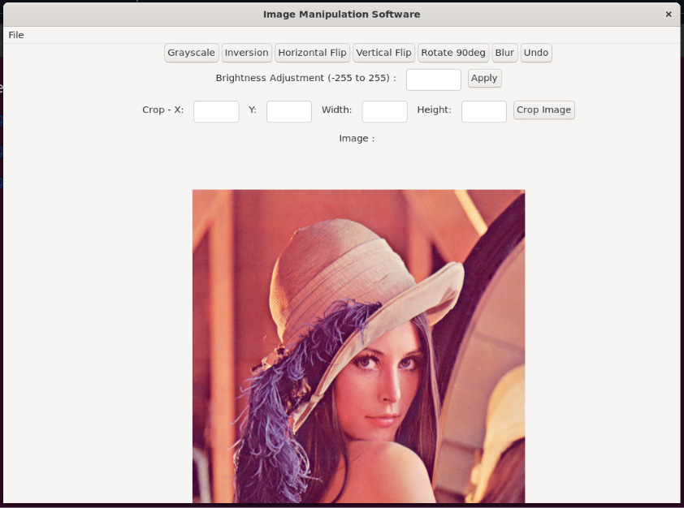

02. Grayscale

The Grayscale operation converts a colored image into shades of gray.

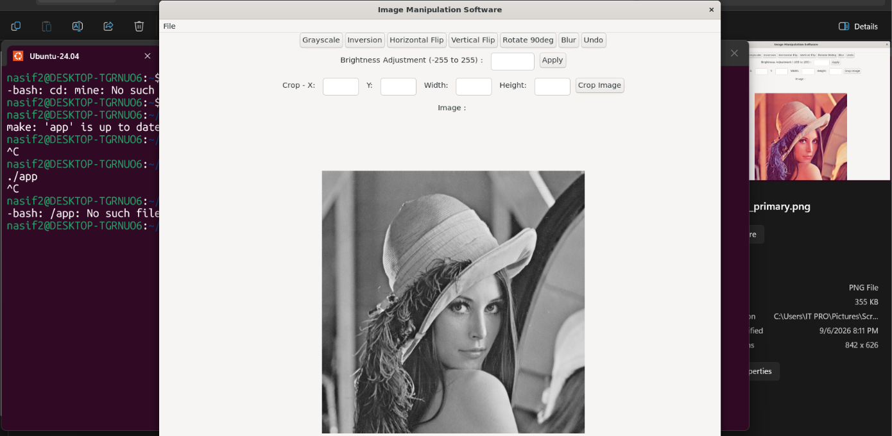

03. Inversion

The Inversion operation reverses the intensity of the image's color channels.

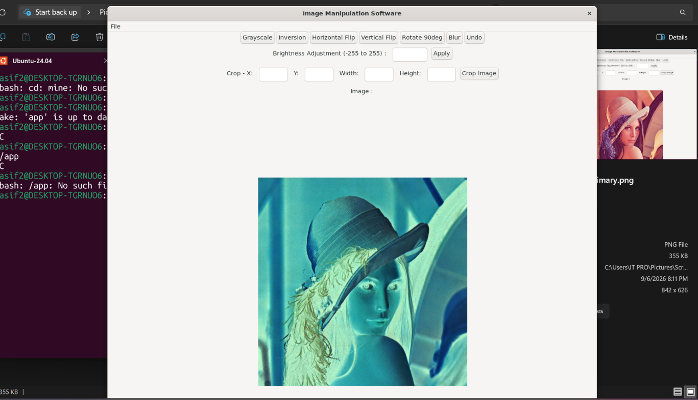

04. Horizontal Flip

The Horizontal Flip operation mirrors the image from left to right.

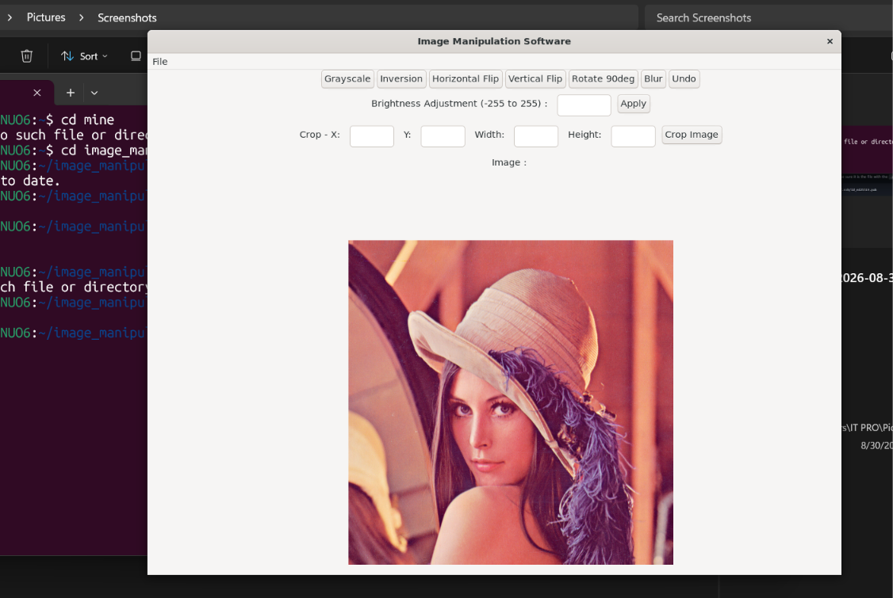

05. Vertical Flip

The Vertical Flip operation mirrors the image from top to bottom.

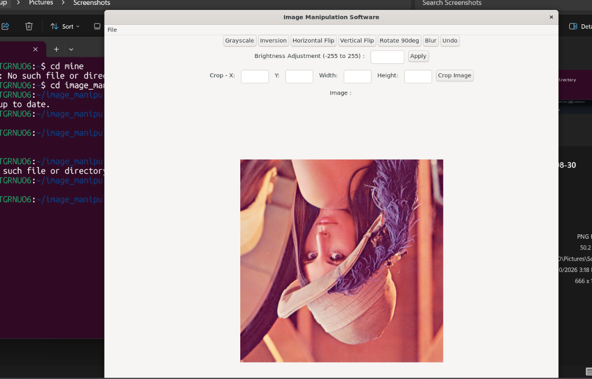

06. Rotate 90°

The Rotate 90° operation rotates the image by 90 degrees.

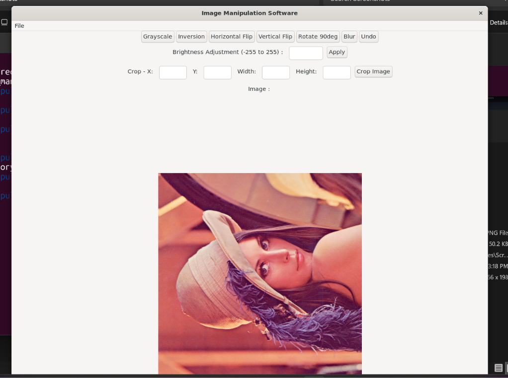

07. Blur

The Blur operation smooths the image by averaging neighboring pixel values.

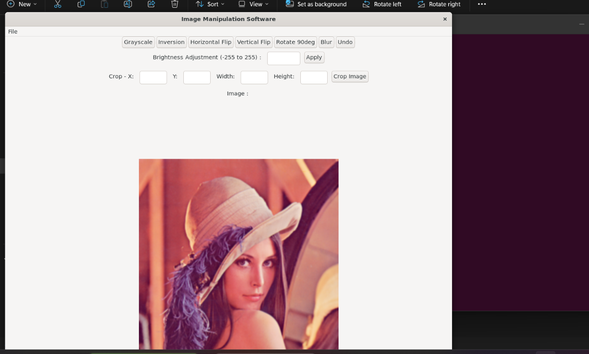

08. Brightness

The Brightness control allows the user to increase or decrease image brightness.

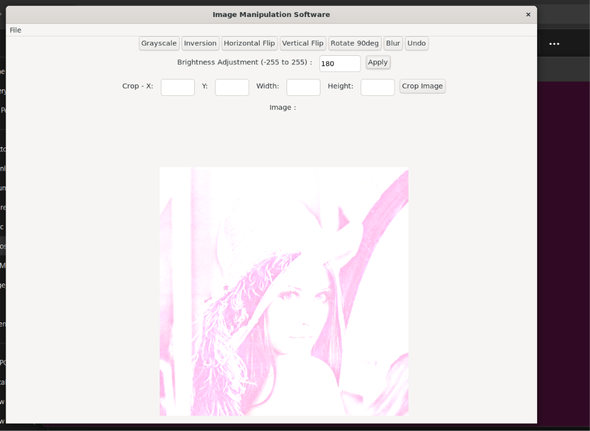

09. Crop

The Crop feature allows the user to select a rectangular area using X, Y, Width, and Height values.

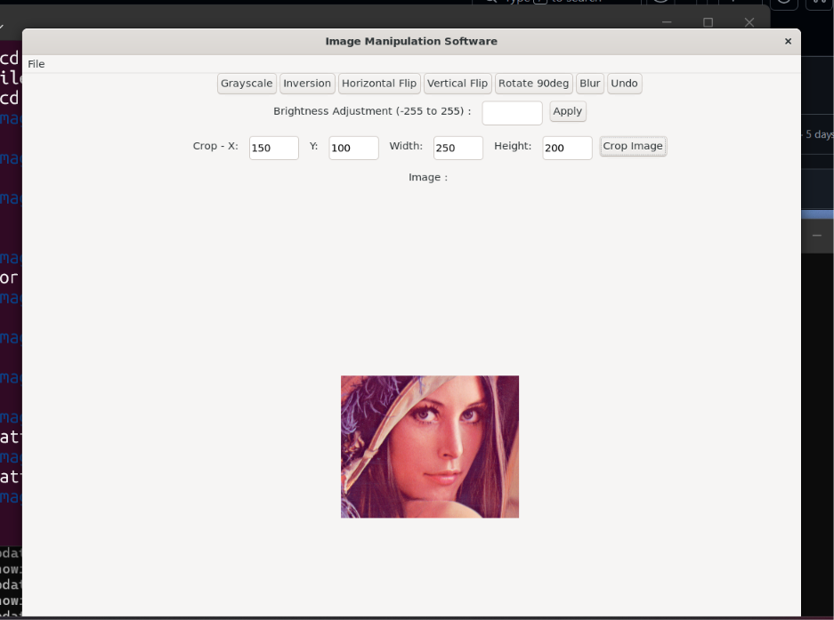

10. Options

The application provides menu and control options for opening, saving, exiting, and manipulating images.

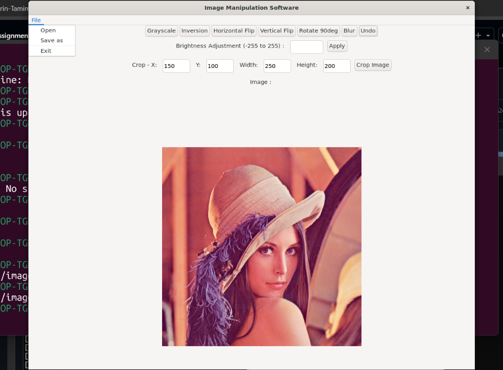

11. Error Popup

The application displays an error or warning popup when invalid input or an invalid operation is detected.

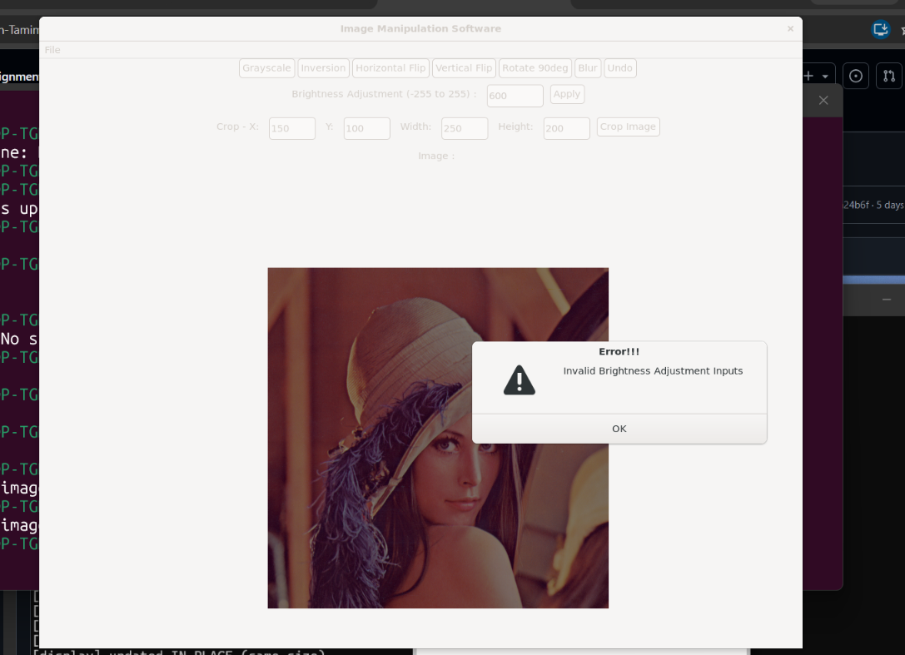

Project Structure

image_manipulation/
├── Makefile
├── README.md
├── include/
│   └── custom.h
├── src/
│   ├── main.c
│   ├── gui.c
│   ├── menu.c
│   ├── controls.c
│   ├── ui.c
│   └── utils.c
├── images/
├── iup/
├── im/
└── screenshots/
    ├── 01_primary.png
    ├── 02_grayacale.png
    ├── 03_inversion.png
    ├── 04_hor_flip.png
    ├── 05_vert_flip.png
    ├── 06_rotate_90.png
    ├── 07_blur.png
    ├── 08_brightness.png
    ├── 09_crop.png
    ├── 10_options.png
    └── 11_error_popup.png

Build and Run

Requirements

The software is designed to run in Ubuntu/Linux or Ubuntu through WSL.

Required packages:

GCC

Make

GTK 3 development libraries

X11 development libraries

pkg-config

The project also contains the IUP and IM libraries used by the Makefile.

Install Dependencies

sudo apt update
sudo apt install build-essential libgtk-3-dev libx11-dev pkg-config

Enter the Project Directory

cd ~/image_manipulation

Change the path if your project is stored somewhere else.

Build

Run:

make app

The Makefile compiles the C source files and links the required libraries. A successful build creates the executable:

app

Run

./app

The Image Manipulation Software GUI will open.

Use the Software

Select File → Open.

Choose a BMP image.

Apply an image operation.

Use Undo when needed.

Select File → Save As to save the processed image.

Clean Build Files

make clean

Technologies Used

Technology

Purpose

C

Application and image-processing logic

IUP

Graphical user interface

IM

Image loading and processing

GTK 3

Linux GUI backend

GCC

Compilation

Make

Build automation

Author

Md Nasifuzzaman
Roll: 1820

Bash Build and Run Commands

Run the following commands from an Ubuntu/WSL terminal:

sudo apt update
sudo apt install build-essential libgtk-3-dev libx11-dev pkg-config

cd ~/image_manipulation

make app

./app
